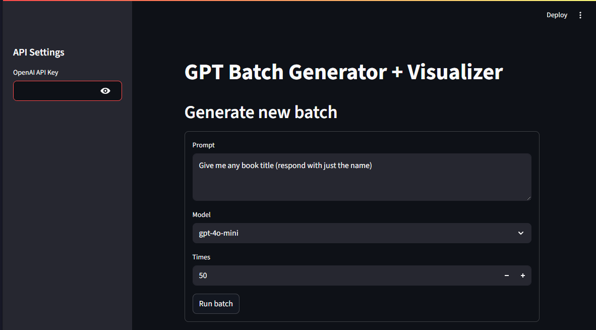

## GPT Batcher
A Streamlit application to send the same prompt to a GPT model a large number of times
to analyze the variation in the responses and detect patterns.

### Why?

Large Language Models have amazing capabilities and (imo) display creativity, however,
they underlie deterministic behavior. Meaning: Same input, same output.

The way how LLMs work fundamentally is that they are an extremely complex, yet pure function
that determines an "optimal" next output based on an input. But instead of just returning one
word, they return a ranked list of possible next words. A random number generator then picks a word
from that list, weighted by its ranking - this randomness parameter is called "temperature".

At 0 temperature, the model will always return the same output for the same input. (The 1st word in the ranking).
At high temperatures, the output can become very chaotic, and this is usually a bad thing (the extreme form
would be random word salad).

It's important to note, the list of rankings is always the same when given the same input (and when using the same model).
You should also note, the input is not just your prompt, but also (parts of) the message history, as well as potentially
"memories" or other metadata injected by an application into the model on every request.

So if you ask ChatGPT the same question twice in a conversation, it will react differenlty, but that is because
the second time you ask, the input is different, because the message history is different.

All of this is to say: The models are inherently deterministic, but the randomness as well as context injection
may make it seem otherwise. Also, the output is not always coherent or "as expected, based on a *similar* input",
which some people conflate with indeterminism - but really it's just chaotic behavior.

My goal here is to demonstrate how model outputs can in fact be predicted, once you
know the input and the model.

For example, I can tell you that gpt-4o-mini has a **78% chance** to return
the name "Liam" when asked `Give me any boy name. (respond just with the name)`. With only 2 other names
making it to the list.

Or similarly, if you ask gpt-4o-mini `Give me a random existing book title (respond with just the name)`, then
there is a whopping **92% chance** that it will return "The Great Gatsby". With only 4 other titles ever being returned.

By using GPT Batcher, you can easily find out these probabilities for yourself. And hopefully get a
feeling for what this means for self-expression.

## Run it online
You can access the app online at https://gpt-batcher.streamlit.app/
Note: at the moment there is no authentication, so anyone will see your inputs and outputs.
If you do not trust the application to handle your API key properly,
you can clone the source code and run it locally instead.

## Build
### Clone and checkout the repository
Clone the repo and checkout the master branch.

### Create a Virtual Environment
Whichever build system you choose, make sure to create a venv first.
So that dependencies are installed for this project and not in your global Python environment.
```shell
python -m venv .venv
source .venv/bin/activate   # Linux/macOS
.venv\Scripts\activate      # Windows
```

### Install Dependencies
You can install the dependencies using either `uv` or `pip`.  
Again, make sure you are in the virtual environment.

#### Build with uv
```bash
uv sync
```

#### Or build it with pip
```bash
pip install -e
```


## Running the application
Run the application (will open a browser window):
```shell
uv run streamlit run .\gpt-batcher\app.py
```

## Providing an API Key
Currently only the OpenAI API is supported.  
You need to provide an API key to use the application.  
You can create one here: https://platform.openai.com/api-keys

Then paste it in the sidebar on the left:


The key is not stored anywhere and you will have to re-enter it
every time you start the application or refresh the page.